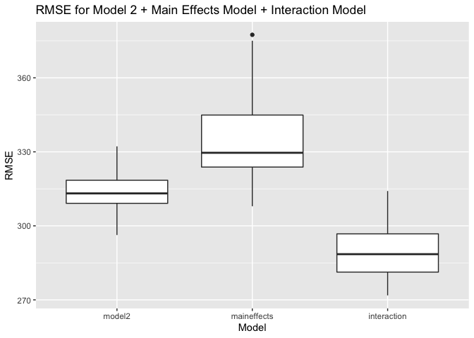

P8105: HW6
================
Sydney Musick

# Problem 1

## Loading packages

``` r
library(tidyverse)
```

    ## ── Attaching packages ─────────────────────────────────────── tidyverse 1.3.1 ──

    ## ✓ ggplot2 3.3.5     ✓ purrr   0.3.4
    ## ✓ tibble  3.1.4     ✓ dplyr   1.0.7
    ## ✓ tidyr   1.1.3     ✓ stringr 1.4.0
    ## ✓ readr   2.0.1     ✓ forcats 0.5.1

    ## ── Conflicts ────────────────────────────────────────── tidyverse_conflicts() ──
    ## x dplyr::filter() masks stats::filter()
    ## x dplyr::lag()    masks stats::lag()

``` r
library(modelr)
```

## Loading data and clean data

``` r
birthweight = 
  read_csv("birthweight.csv") %>% 
    janitor::clean_names() %>% 
    mutate(babysex = factor(babysex, levels = c(1,2), labels = c("Male", "Female"))) %>%
    mutate(frace = factor(frace, levels = c(1,2,3,4,8,9), labels = c("White", "Black",
      "Asian", "Puerto Rican", "Other", "Unknown"))) %>%
    mutate(mrace = factor(mrace, levels = c(1,2,3,4,8,9), labels = c("White", "Black",
      "Asian", "Puerto Rican", "Other", "Unknown"))) %>%
    mutate(malform = factor(malform, levels = c(0,1), labels = c("Absent", "Present")))
```

    ## Rows: 4342 Columns: 20

    ## ── Column specification ────────────────────────────────────────────────────────
    ## Delimiter: ","
    ## dbl (20): babysex, bhead, blength, bwt, delwt, fincome, frace, gaweeks, malf...

    ## 
    ## ℹ Use `spec()` to retrieve the full column specification for this data.
    ## ℹ Specify the column types or set `show_col_types = FALSE` to quiet this message.

Appropriate numeric variables converted to factor variables.

## Check for missing values

``` r
colSums(is.na(birthweight))
```

    ##  babysex    bhead  blength      bwt    delwt  fincome    frace  gaweeks 
    ##        0        0        0        0        0        0        0        0 
    ##  malform menarche  mheight   momage    mrace   parity  pnumlbw  pnumsga 
    ##        0        0        0        0        0        0        0        0 
    ##    ppbmi     ppwt   smoken   wtgain 
    ##        0        0        0        0

No missing values.

## Regression model building

To build my model, I will include all clinically relevant variables as
predictors based on current literature. I will then remove the variables
that are not significant predictors of birthweight in subsequent models.

From a brief review of online literature, it appears that gestational
age, sex, maternal height, maternal weight, maternal weight gain,
previous births, smoking status, head circumference, maternal race,
paternal race, and malformations have all been predictors of birthweight
in previous studies. Therefore, for the first model I will include
variables `gaweeks`, `babysex`, `mheight`, `ppwt`, `wtgain`, `parity`,
`smoken`, `bhead`, `mrace`, `frace`, `malform`.

### Model 1

``` r
model1 = lm(bwt ~ gaweeks + babysex + mheight + ppwt + wtgain + parity + smoken + bhead + mrace + frace + malform, data = birthweight)

summary(model1)
```

    ## 
    ## Call:
    ## lm(formula = bwt ~ gaweeks + babysex + mheight + ppwt + wtgain + 
    ##     parity + smoken + bhead + mrace + frace + malform, data = birthweight)
    ## 
    ## Residuals:
    ##      Min       1Q   Median       3Q      Max 
    ## -1088.43  -211.58    -1.68   204.37  2173.25 
    ## 
    ## Coefficients:
    ##                     Estimate Std. Error t value Pr(>|t|)    
    ## (Intercept)       -5325.8495   156.2641 -34.082  < 2e-16 ***
    ## gaweeks              19.9606     1.6587  12.034  < 2e-16 ***
    ## babysexFemale        22.0134     9.7093   2.267  0.02342 *  
    ## mheight              11.4697     2.0394   5.624 1.98e-08 ***
    ## ppwt                  1.9527     0.2663   7.332 2.68e-13 ***
    ## wtgain                5.4998     0.4484  12.266  < 2e-16 ***
    ## parity               74.2742    46.3118   1.604  0.10883    
    ## smoken               -6.7193     0.6710 -10.013  < 2e-16 ***
    ## bhead               198.0515     3.3685  58.795  < 2e-16 ***
    ## mraceBlack         -159.8227    52.7944  -3.027  0.00248 ** 
    ## mraceAsian         -103.8208    82.3966  -1.260  0.20773    
    ## mracePuerto Rican   -94.5831    51.7391  -1.828  0.06761 .  
    ## fraceBlack          -14.9877    52.8772  -0.283  0.77685    
    ## fraceAsian           26.2586    79.4810   0.330  0.74113    
    ## fracePuerto Rican   -35.9869    51.2286  -0.702  0.48242    
    ## fraceOther          -30.8255    84.9139  -0.363  0.71661    
    ## malformPresent      -31.3401    81.0268  -0.387  0.69893    
    ## ---
    ## Signif. codes:  0 '***' 0.001 '**' 0.01 '*' 0.05 '.' 0.1 ' ' 1
    ## 
    ## Residual standard error: 312.8 on 4325 degrees of freedom
    ## Multiple R-squared:  0.6284, Adjusted R-squared:  0.6271 
    ## F-statistic: 457.2 on 16 and 4325 DF,  p-value: < 2.2e-16

``` r
model1 %>% 
  broom::tidy() %>% 
  knitr::kable(digits = 2)
```

| term              | estimate | std.error | statistic | p.value |
|:------------------|---------:|----------:|----------:|--------:|
| (Intercept)       | -5325.85 |    156.26 |    -34.08 |    0.00 |
| gaweeks           |    19.96 |      1.66 |     12.03 |    0.00 |
| babysexFemale     |    22.01 |      9.71 |      2.27 |    0.02 |
| mheight           |    11.47 |      2.04 |      5.62 |    0.00 |
| ppwt              |     1.95 |      0.27 |      7.33 |    0.00 |
| wtgain            |     5.50 |      0.45 |     12.27 |    0.00 |
| parity            |    74.27 |     46.31 |      1.60 |    0.11 |
| smoken            |    -6.72 |      0.67 |    -10.01 |    0.00 |
| bhead             |   198.05 |      3.37 |     58.79 |    0.00 |
| mraceBlack        |  -159.82 |     52.79 |     -3.03 |    0.00 |
| mraceAsian        |  -103.82 |     82.40 |     -1.26 |    0.21 |
| mracePuerto Rican |   -94.58 |     51.74 |     -1.83 |    0.07 |
| fraceBlack        |   -14.99 |     52.88 |     -0.28 |    0.78 |
| fraceAsian        |    26.26 |     79.48 |      0.33 |    0.74 |
| fracePuerto Rican |   -35.99 |     51.23 |     -0.70 |    0.48 |
| fraceOther        |   -30.83 |     84.91 |     -0.36 |    0.72 |
| malformPresent    |   -31.34 |     81.03 |     -0.39 |    0.70 |

The significant predictors in this model were gestational age, sex,
maternal height, maternal weight, maternal weight gain, smoking status,
head circumference, and maternal race - Black. Previous births, maternal
race - Asian or Puerto Rican, paternal race - Black, Asian, Puerto
Rican, or Other, and malformations were not significant predictors of
birthweight.

I will remove the nonsignificant variables from the model for Model 2.
Note: I am chosing to include `mrace` because maternal race was a
significant preditor of birthweight for black mothers.

### Model 2

``` r
model2 = lm(bwt ~ gaweeks + babysex + mheight + ppwt + wtgain + smoken + bhead + mrace, data = birthweight)

summary(model2)
```

    ## 
    ## Call:
    ## lm(formula = bwt ~ gaweeks + babysex + mheight + ppwt + wtgain + 
    ##     smoken + bhead + mrace, data = birthweight)
    ## 
    ## Residuals:
    ##      Min       1Q   Median       3Q      Max 
    ## -1086.64  -211.27    -1.36   204.19  2173.98 
    ## 
    ## Coefficients:
    ##                     Estimate Std. Error t value Pr(>|t|)    
    ## (Intercept)       -5322.1552   156.0112 -34.114  < 2e-16 ***
    ## gaweeks              19.7628     1.6525  11.960  < 2e-16 ***
    ## babysexFemale        22.5010     9.7010   2.319   0.0204 *  
    ## mheight              11.4894     2.0373   5.639 1.81e-08 ***
    ## ppwt                  1.9436     0.2658   7.313 3.11e-13 ***
    ## wtgain                5.5052     0.4477  12.297  < 2e-16 ***
    ## smoken               -6.7162     0.6696 -10.030  < 2e-16 ***
    ## bhead               198.1471     3.3648  58.888  < 2e-16 ***
    ## mraceBlack         -174.3338    10.5517 -16.522  < 2e-16 ***
    ## mraceAsian          -83.3761    48.5442  -1.718   0.0860 .  
    ## mracePuerto Rican  -127.6312    21.9221  -5.822 6.23e-09 ***
    ## ---
    ## Signif. codes:  0 '***' 0.001 '**' 0.01 '*' 0.05 '.' 0.1 ' ' 1
    ## 
    ## Residual standard error: 312.7 on 4331 degrees of freedom
    ## Multiple R-squared:  0.6281, Adjusted R-squared:  0.6273 
    ## F-statistic: 731.5 on 10 and 4331 DF,  p-value: < 2.2e-16

``` r
model2 %>% 
  broom::tidy() %>% 
  knitr::kable(digits = 2)
```

| term              | estimate | std.error | statistic | p.value |
|:------------------|---------:|----------:|----------:|--------:|
| (Intercept)       | -5322.16 |    156.01 |    -34.11 |    0.00 |
| gaweeks           |    19.76 |      1.65 |     11.96 |    0.00 |
| babysexFemale     |    22.50 |      9.70 |      2.32 |    0.02 |
| mheight           |    11.49 |      2.04 |      5.64 |    0.00 |
| ppwt              |     1.94 |      0.27 |      7.31 |    0.00 |
| wtgain            |     5.51 |      0.45 |     12.30 |    0.00 |
| smoken            |    -6.72 |      0.67 |    -10.03 |    0.00 |
| bhead             |   198.15 |      3.36 |     58.89 |    0.00 |
| mraceBlack        |  -174.33 |     10.55 |    -16.52 |    0.00 |
| mraceAsian        |   -83.38 |     48.54 |     -1.72 |    0.09 |
| mracePuerto Rican |  -127.63 |     21.92 |     -5.82 |    0.00 |

All predictors in the model are now significant, except the race of
Asian mothers.

## Plotting model residuals against fitted values

``` r
birthweight %>% 
  modelr::add_predictions(model2) %>%
  modelr::add_residuals(model2) %>% 
  ggplot(aes(x = pred, y = resid)) +
  geom_point(alpha = 0.3) +
  labs(x = "Fitted Values", y = "Residuals") + 
  ggtitle("Model 2: Residuals vs. Fitted Values") 
```

<!-- -->

## Model using length at birth and gestational age as predictors (main effects only)

``` r
maineffects_model = lm(bwt ~ blength + gaweeks, data = birthweight)

summary(maineffects_model)
```

    ## 
    ## Call:
    ## lm(formula = bwt ~ blength + gaweeks, data = birthweight)
    ## 
    ## Residuals:
    ##     Min      1Q  Median      3Q     Max 
    ## -1709.6  -215.4   -11.4   208.2  4188.8 
    ## 
    ## Coefficients:
    ##              Estimate Std. Error t value Pr(>|t|)    
    ## (Intercept) -4347.667     97.958  -44.38   <2e-16 ***
    ## blength       128.556      1.990   64.60   <2e-16 ***
    ## gaweeks        27.047      1.718   15.74   <2e-16 ***
    ## ---
    ## Signif. codes:  0 '***' 0.001 '**' 0.01 '*' 0.05 '.' 0.1 ' ' 1
    ## 
    ## Residual standard error: 333.2 on 4339 degrees of freedom
    ## Multiple R-squared:  0.5769, Adjusted R-squared:  0.5767 
    ## F-statistic:  2958 on 2 and 4339 DF,  p-value: < 2.2e-16

``` r
maineffects_model %>% 
  broom::tidy() %>% 
  knitr::kable(digits = 2)
```

| term        | estimate | std.error | statistic | p.value |
|:------------|---------:|----------:|----------:|--------:|
| (Intercept) | -4347.67 |     97.96 |    -44.38 |       0 |
| blength     |   128.56 |      1.99 |     64.60 |       0 |
| gaweeks     |    27.05 |      1.72 |     15.74 |       0 |

## Model using head circumference, length, sex, and all interactions (including the three-way interaction)

``` r
interaction_model = lm(bwt ~ blength * bhead * babysex, data = birthweight)

summary(interaction_model)
```

    ## 
    ## Call:
    ## lm(formula = bwt ~ blength * bhead * babysex, data = birthweight)
    ## 
    ## Residuals:
    ##      Min       1Q   Median       3Q      Max 
    ## -1132.99  -190.42   -10.33   178.63  2617.96 
    ## 
    ## Coefficients:
    ##                               Estimate Std. Error t value Pr(>|t|)    
    ## (Intercept)                 -7176.8170  1264.8397  -5.674 1.49e-08 ***
    ## blength                       102.1269    26.2118   3.896 9.92e-05 ***
    ## bhead                         181.7956    38.0542   4.777 1.84e-06 ***
    ## babysexFemale                6374.8684  1677.7669   3.800 0.000147 ***
    ## blength:bhead                  -0.5536     0.7802  -0.710 0.478012    
    ## blength:babysexFemale        -123.7729    35.1185  -3.524 0.000429 ***
    ## bhead:babysexFemale          -198.3932    51.0917  -3.883 0.000105 ***
    ## blength:bhead:babysexFemale     3.8781     1.0566   3.670 0.000245 ***
    ## ---
    ## Signif. codes:  0 '***' 0.001 '**' 0.01 '*' 0.05 '.' 0.1 ' ' 1
    ## 
    ## Residual standard error: 287.7 on 4334 degrees of freedom
    ## Multiple R-squared:  0.6849, Adjusted R-squared:  0.6844 
    ## F-statistic:  1346 on 7 and 4334 DF,  p-value: < 2.2e-16

``` r
interaction_model %>% 
  broom::tidy() %>% 
  knitr::kable(digits = 2)
```

| term                        | estimate | std.error | statistic | p.value |
|:----------------------------|---------:|----------:|----------:|--------:|
| (Intercept)                 | -7176.82 |   1264.84 |     -5.67 |    0.00 |
| blength                     |   102.13 |     26.21 |      3.90 |    0.00 |
| bhead                       |   181.80 |     38.05 |      4.78 |    0.00 |
| babysexFemale               |  6374.87 |   1677.77 |      3.80 |    0.00 |
| blength:bhead               |    -0.55 |      0.78 |     -0.71 |    0.48 |
| blength:babysexFemale       |  -123.77 |     35.12 |     -3.52 |    0.00 |
| bhead:babysexFemale         |  -198.39 |     51.09 |     -3.88 |    0.00 |
| blength:bhead:babysexFemale |     3.88 |      1.06 |      3.67 |    0.00 |

## Compare Model 2 to the Main Effects Model and the Interaction Model

``` r
crossv = 
  crossv_mc(birthweight, 50) %>% 
  mutate(train = map(train, as_tibble), test = map(test, as_tibble))

crossv = crossv %>% 
  mutate(
    model2 = map(train, ~lm(bwt ~ gaweeks + babysex + mheight + ppwt + wtgain + smoken + bhead + mrace, data = .x)),
    maineffects_model = map(train, ~lm(bwt ~ blength + gaweeks, data = .x)),
    interaction_model = map(train, ~lm(bwt ~ bhead * blength * babysex, data = .x))) %>% 
  mutate(
    rmse_model2 = map2_dbl(model2, test, ~rmse(model = .x, data = .y)),
    rmse_maineffects = map2_dbl(maineffects_model, test, ~rmse(model = .x, data = .y)),
    rmse_interaction = map2_dbl(interaction_model, test, ~rmse(model = .x, data = .y))) %>%
  select(starts_with("rmse")) %>%  
  pivot_longer(
    everything(),
    names_to = "model", 
    values_to = "rmse",
    names_prefix = "rmse_") %>% 
  mutate(model = fct_inorder(model)) 

ggplot(crossv, aes(x = model, y = rmse)) +
geom_boxplot() +
labs(x = "Model", y = "RMSE") +
ggtitle("RMSE for Model 2 + Main Effects Model + Interaction Model") 
```

<!-- -->

Looking at the plot, we can see that the best fitting model is the model
with the interaction terms because it has the lowest RMSE. The worst
fitting model is the Main Effects Model because it has the highest RMSE.
My model (Model 2) has a better fit than the Main Effects Model, but a
worse fit than the Interaction Model.

# Problem 2

## Loading the data

``` r
weather_df = 
  rnoaa::meteo_pull_monitors(
    c("USW00094728"),
    var = c("PRCP", "TMIN", "TMAX"), 
    date_min = "2017-01-01",
    date_max = "2017-12-31") %>%
  mutate(
    name = recode(id, USW00094728 = "CentralPark_NY"),
    tmin = tmin / 10,
    tmax = tmax / 10) %>%
  select(name, id, everything())
```

    ## Registered S3 method overwritten by 'hoardr':
    ##   method           from
    ##   print.cache_info httr

    ## using cached file: ~/Library/Caches/R/noaa_ghcnd/USW00094728.dly

    ## date created (size, mb): 2021-12-04 16:31:52 (7.616)

    ## file min/max dates: 1869-01-01 / 2021-12-31

## Producing r^2 and log(B0\*B1) estimates

``` r
weather = weather_df %>% 
  bootstrap(n = 5000) %>% 
  mutate(
    models = map(strap, ~lm(tmax ~tmin, data = .x)),
    glance = map(models, broom::glance),
    results = map(models, broom::tidy)) %>%
  unnest(results) %>% 
  unnest(glance, names_repair = "universal") %>% 
  select(strap, models, .id, r.squared, term, estimate)
```

    ## New names:
    ## * statistic -> statistic...7
    ## * p.value -> p.value...8
    ## * statistic -> statistic...19
    ## * p.value -> p.value...20

``` r
weather_estimates = weather %>% 
  mutate(term = if_else(term == "tmin", "tmin", "intercept")) %>% 
  pivot_wider(
    names_from = "term",
    values_from = "estimate") %>% 
  mutate(log_b0b1 = log(intercept) + log(tmin))
```

## Plotting the r^2 values

``` r
ggplot(weather_estimates, aes(x = r.squared)) + 
geom_density() +
labs(x = "R Squared", y = "Density") +
ggtitle("R Squared Distribution for 5,000 Bootstrap Samples")
```

<!-- -->

## Plotting the log(B0\*B1) values

``` r
ggplot(weather_estimates, aes(x = log_b0b1)) + 
geom_density() +
labs(x = "Log(B0*B1)", y = "Density") +
ggtitle("Log(B0*B1) Distribution for 5,000 Bootstrap Samples") 
```

<!-- -->

The R Squared and Log(B0\*B1) plots are both normally distributed. The
plot of R squared has a midpoint value of about 0.91, while the
Log(B0xB1) plot is centered around about 2.02.

# Finding the 95% confidence intervals

``` r
rsquared_ci = weather_estimates %>%
  summarize(
    r_squared_lower = quantile(r.squared, c(.025)),
    r_squared_upper = quantile(r.squared, c(.975)))

knitr::kable( rsquared_ci)
```

| r\_squared\_lower | r\_squared\_upper |
|------------------:|------------------:|
|          0.893864 |         0.9271245 |

``` r
betas_ci = weather_estimates %>%
  summarize(
    logb0b1_lower = quantile(log_b0b1, c(.025)),
    logb0b1_upper = quantile(log_b0b1, c(.975)))

knitr::kable(betas_ci)
```

| logb0b1\_lower | logb0b1\_upper |
|---------------:|---------------:|
|       1.965801 |       2.059107 |

The 95% confidence interval for R-Squared is (0.89, 0.93). The 95%
confidence interval for log(B0\*B1) is (1.97, 2.06).
